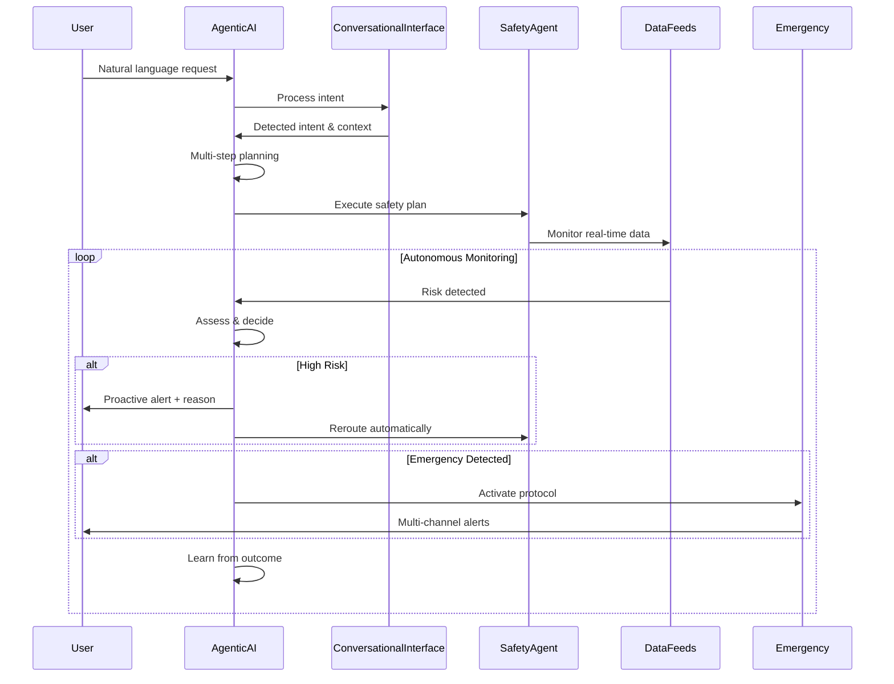

# SafeTrail 🌐🛡️🤖

**An Advanced Agentic AI-Powered Safety Navigation System**  
_Autonomous route protection with conversational AI, real-time risk intervention, and intelligent emergency protocols_

## 🚀 Live Links

- **Frontend**: https://safetrail.vercel.app
- **Backend API**: https://safetrail-dfkn.onrender.com
- **Source Code**: https://github.com/HariCodesHere/SafeTrail

## 🛠️ Tech Stack

| Component            | Technology                                    |
| -------------------- | --------------------------------------------- |
| **Frontend**         | Next.js 14, React, TypeScript, Tailwind CSS  |
| **Backend**          | Python FastAPI, WebSockets                   |
| **Agentic AI**       | Google Gemini Pro, Multi-Step Planning       |
| **Real-Time**        | WebSockets, Firebase Cloud Messaging         |
| **Maps & Routing**   | OpenStreetMap, Leaflet, OpenRouteService     |
| **Database**         | Supabase (PostgreSQL)                        |
| **Emergency System** | Twilio SMS, Emergency Services Integration    |
| **Authentication**   | Firebase Auth (Google, Email/Password)       |

## 🤖 Agentic AI Features

### **Core Agentic Capabilities**
✅ **Autonomous Decision-Making** - AI makes independent safety decisions based on real-time data  
✅ **Conversational Interface** - Natural language chat with context-aware responses  
✅ **Multi-Step Planning** - Complex route planning with reasoning and fallback strategies  
✅ **Adaptive Learning** - Learns from user patterns and improves over time  
✅ **Proactive Monitoring** - Continuous autonomous safety monitoring  
✅ **Intent Detection** - Understands user needs from natural language  
✅ **Memory System** - Remembers past interactions and preferences  
✅ **Emergency Intelligence** - Automatic emergency detection and response  

### **Advanced AI Features**
- **Real-Time Risk Assessment** with Gemini Pro AI
- **Contextual Understanding** of user location and preferences  
- **Autonomous Route Optimization** based on safety conditions
- **Predictive Safety Modeling** using historical data
- **Multi-Modal Communication** (text, voice, visual alerts)
- **Learning from User Feedback** and behavioral patterns

## 🔄 Agentic Workflow



## 📡 API Endpoints

### **Core Journey Endpoints**
- `POST /api/user/profile` - Create/update user safety profile
- `POST /api/journey/start` - Start monitored journey
- `POST /api/journey/stop/{user_id}` - Stop journey monitoring
- `POST /api/emergency/trigger` - Manual emergency activation
- `WebSocket /ws/{user_id}` - Real-time journey updates

### **🤖 Agentic AI Endpoints**
- `POST /api/agentic/chat/{user_id}` - Conversational AI chat
- `POST /api/agentic/start-session/{user_id}` - Start AI session
- `POST /api/agentic/end-session/{user_id}` - End AI session  
- `GET /api/agentic/stats/{user_id}` - AI learning insights
- `POST /api/agentic/autonomous-request` - Multi-step AI planning
- `WebSocket /ws/agentic/{user_id}` - Real-time AI communication

### **System Endpoints**
- `GET /api/health` - System health check
- `GET /` - API status and version

## 💬 Conversational AI Interface

### **Natural Language Capabilities**
The AI understands and responds to various intents:

- **Route Planning**: _"Find me the safest route to downtown"_
- **Safety Inquiries**: _"Am I safe here? Check my current location"_
- **Emergency Requests**: _"I need help, this doesn't feel safe"_
- **Weather & Traffic**: _"What's the weather like on my route?"_
- **Learning Requests**: _"Remember I prefer well-lit streets"_
- **Location Sharing**: _"Share my location with emergency contacts"_

### **WebSocket Communication Protocol**

**Client → Server (Chat):**
```json
{
  "type": "chat_message",
  "message": "Find safest route to Central Park",
  "context": {
    "location": {"lat": 40.7589, "lng": -73.9851},
    "riskLevel": "medium",
    "timeOfDay": "evening"
  }
}
```

**Server → Client (AI Response):**
```json
{
  "type": "chat_response", 
  "data": "I've analyzed your route. Here's the safest path...",
  "metadata": {
    "confidence": 0.95,
    "safety_priority": "high",
    "actions": ["route_calculated", "monitoring_started"],
    "reasoning": "Avoided high-crime area on 5th Avenue",
    "proactive_suggestions": ["Enable live location sharing"]
  }
}
```

## 🧠 Implementation Architecture

### **1. Agentic AI System**

```python
class AgenticAI:
    """Advanced autonomous AI agent with learning and planning"""
    
    def __init__(self, user_id: str, database: Database, emergency_protocol: EmergencyProtocol):
        self.state = AgentState.IDLE  # idle, planning, monitoring, responding, learning
        self.memory = AgentMemory()   # User patterns, safety incidents, preferences
        self.model = genai.GenerativeModel('gemini-1.5-flash-latest')
        
    async def autonomous_decision_making(self, context: Dict[str, Any]):
        """Make independent decisions based on context and learned patterns"""
        
    async def multi_step_planning(self, user_request: str, context: Dict[str, Any]):
        """Create comprehensive plans with reasoning and fallbacks"""
        
    async def learn_from_interaction(self, interaction_data: Dict[str, Any]):
        """Continuously learn and adapt from user interactions"""
```

### **2. Conversational Interface**

```python
class ConversationalInterface:
    """Natural language processing for agentic interactions"""
    
    def __init__(self, database: Database, emergency_protocol: EmergencyProtocol):
        self.intent_patterns = {
            'route_planning': [r'plan.*route', r'navigate.*to', r'safest.*route'],
            'safety_check': [r'am.*i.*safe', r'check.*safety', r'risk.*assessment'],
            'emergency': [r'emergency', r'help.*me', r'danger', r'need.*help']
        }
        
    async def process_conversation(self, user_id: str, message: str, context: Dict[str, Any]):
        """Process natural language input and generate intelligent responses"""
```

### **3. Enhanced Safety Agent**

```python
class SafetyAgent:
    """AI-powered safety monitoring with autonomous intervention"""
    
    async def monitor_journey(self, journey_request: JourneyRequest):
        while self.journey_active:
            risk_assessment = await self.ai_risk_analysis(current_location)
            
            if risk_assessment.risk_level > user_threshold:
                # Autonomous decision making
                new_route = await self.agentic_ai.plan_alternative_route()
                await self.notify_user_with_reasoning(risk_assessment)
                
            await self.check_user_responsiveness()
```

## 🚀 Quick Start Guide

### **1. Prerequisites**
- **Python 3.9+** and **Node.js 18+**
- **API Keys**: Google Gemini, Twilio, Supabase, Firebase
- **Optional**: Google Maps, OpenRouteService APIs

### **2. Installation**

```bash
# Clone repository
git clone https://github.com/HariCodesHere/SafeTrail.git
cd SafeTrail

# Automated setup (recommended)
python setup.py

# OR Manual installation
# Frontend
npm install
# Backend  
pip install -r requirements.txt
```

### **3. Environment Configuration**

Create `.env` in root directory:

```env
# Core AI Configuration
GEMINI_API_KEY=your_google_ai_api_key

# Communication APIs
TWILIO_ACCOUNT_SID=your_twilio_sid
TWILIO_AUTH_TOKEN=your_twilio_auth_token
TWILIO_PHONE_NUMBER=your_twilio_phone_number

# Database & Authentication
SUPABASE_URL=your_supabase_project_url
SUPABASE_ANON_KEY=your_supabase_anon_key
SUPABASE_SERVICE_ROLE_KEY=your_supabase_service_role_key

NEXT_PUBLIC_FIREBASE_API_KEY=your_firebase_api_key
NEXT_PUBLIC_FIREBASE_AUTH_DOMAIN=your_project.firebaseapp.com
NEXT_PUBLIC_FIREBASE_PROJECT_ID=your_firebase_project_id

# Application URLs
NEXT_PUBLIC_API_URL=http://localhost:8000
BACKEND_PORT=8000
FRONTEND_PORT=3000

# Optional APIs
NEXT_PUBLIC_ORS_API_KEY=your_openrouteservice_key
NEXT_PUBLIC_GOOGLE_MAPS_API_KEY=your_google_maps_key

# Development/Demo Settings
NODE_ENV=development
NEXT_PUBLIC_FORCE_LOCATION=40.7128,-74.0060  # NYC coordinates for testing
```

### **4. Database Setup**

Run the following SQL in your Supabase dashboard:

```sql
-- User profiles with AI preferences
CREATE TABLE user_profiles (
    id UUID PRIMARY KEY DEFAULT gen_random_uuid(),
    firebase_uid TEXT UNIQUE NOT NULL,
    email TEXT NOT NULL,
    name TEXT,
    phone TEXT,
    safety_preferences JSONB DEFAULT '{}',
    emergency_contacts JSONB DEFAULT '[]',
    ai_learning_enabled BOOLEAN DEFAULT true,
    created_at TIMESTAMP DEFAULT NOW()
);

-- AI conversation history
CREATE TABLE agentic_conversations (
    id UUID PRIMARY KEY DEFAULT gen_random_uuid(),
    user_id UUID REFERENCES user_profiles(id),
    session_id TEXT NOT NULL,
    message_type TEXT NOT NULL, -- 'user' or 'agent'
    content TEXT NOT NULL,
    metadata JSONB DEFAULT '{}',
    created_at TIMESTAMP DEFAULT NOW()
);

-- Journey records with AI decisions
CREATE TABLE journey_records (
    id UUID PRIMARY KEY DEFAULT gen_random_uuid(),
    user_id UUID REFERENCES user_profiles(id),
    start_location JSONB NOT NULL,
    end_location JSONB NOT NULL,
    route_data JSONB,
    ai_decisions JSONB DEFAULT '[]',
    safety_incidents JSONB DEFAULT '[]',
    journey_status TEXT DEFAULT 'active',
    created_at TIMESTAMP DEFAULT NOW(),
    completed_at TIMESTAMP
);
```

### **5. Launch Application**

```bash
# Start backend (Terminal 1)
cd backend
uvicorn main:app --reload --host 0.0.0.0 --port 8000

# Start frontend (Terminal 2) 
npm run dev
```

**Access**: `http://localhost:3000`

## 🎯 Usage Examples

### **Conversational AI Interaction**

```typescript
// Frontend - AgenticChat.tsx integration
const handleSendMessage = async () => {
  const response = await fetch('/api/agentic/chat/user123', {
    method: 'POST',
    headers: { 'Content-Type': 'application/json' },
    body: JSON.stringify({
      message: "I need to get to Times Square safely",
      context: { 
        location: { lat: 40.7589, lng: -73.9851 },
        riskLevel: "medium",
        timeOfDay: "evening"
      }
    })
  });
  
  const aiResponse = await response.json();
  // AI provides route + safety reasoning + proactive suggestions
}
```

### **Autonomous AI Planning**

```json
// POST /api/agentic/autonomous-request
{
  "user_id": "user123",
  "request": "Plan a safe evening route with good lighting and avoid construction zones",
  "context": {
    "departure_time": "2024-01-15T19:00:00Z",
    "user_preferences": {"avoid_crowds": true, "prefer_main_roads": true},
    "risk_tolerance": "low"
  }
}

// AI Response includes:
// - Multi-step route plan with reasoning
// - Alternative routes with risk analysis  
// - Proactive safety measures
// - Real-time monitoring activation
```

## 🛡️ Safety & Security Features

### **AI-Powered Safety Matrix**

| **Risk Condition**              | **Autonomous AI Action**                    | **User Notification**           |
| -------------------------------- | ------------------------------------------- | ------------------------------- |
| Crime reported on planned route  | Auto-reroute + risk analysis               | "Route updated: safety concern" |
| User deviates from safe path     | Contextual check-in + location analysis    | "Are you safe? Tap to confirm" |
| No response to safety check      | Emergency contact alert + location sharing  | Multiple communication channels |
| High-risk area detected ahead    | Proactive route adjustment                  | "Safer alternative suggested"   |
| Emergency button activated       | Immediate multi-stage emergency protocol    | "Emergency services contacted"  |
| Unusual behavior pattern         | Intelligent wellness check                  | "Everything okay? Just checking" |

### **Privacy & Data Protection**
- **End-to-end encryption** for location data
- **Local AI processing** where possible  
- **Granular privacy controls** for data sharing
- **GDPR compliant** data handling
- **User consent** for all AI learning features

## 🔮 Roadmap

### **Phase 1: Enhanced Intelligence** (Current)
- [x] Advanced agentic AI with autonomous decision-making
- [x] Conversational interface with natural language processing
- [x] Multi-step planning and reasoning capabilities
- [x] Real-time learning and adaptation

### **Phase 2: Expanded Intelligence** (Q2 2024)
- [ ] Multi-modal AI (voice, image, sensor data)
- [ ] Predictive risk modeling with ML
- [ ] Group journey coordination
- [ ] IoT device integration (smartwatches, vehicle systems)

### **Phase 3: Community Intelligence** (Q3 2024)  
- [ ] Crowdsourced safety data with AI validation
- [ ] Community-driven safety insights
- [ ] Cross-platform emergency coordination
- [ ] Integration with smart city infrastructure

### **Phase 4: Global Intelligence** (Q4 2024)
- [ ] Multi-language conversational AI
- [ ] Cultural context adaptation
- [ ] International emergency protocols  
- [ ] Federated learning across regions

## 👥 Contributors

- **Harikrishnan Santhosh** — Lead Developer — https://github.com/HariCodesHere
- **Gauri J** — Frontend Specialist — https://github.com/GauriCode
- **Tejas Premod** — Backend Engineer — https://github.com/TejasPremod  
- **Keerthana V T** — AI/ML Engineer — https://github.com/KeerthanaVT
- **Bharath M Guptha** — Full-Stack Developer — https://github.com/0-BMG-0

## 📄 License

This project is licensed under the MIT License - see the [LICENSE](LICENSE) file for details.

## 🆘 Support

For technical support, feature requests, or contributions:
- **GitHub Issues**: [Create an issue](https://github.com/HariCodesHere/SafeTrail/issues)
- **Documentation**: See [SETUP_GUIDE.md](SETUP_GUIDE.md) for detailed setup
- **Discussions**: [GitHub Discussions](https://github.com/HariCodesHere/SafeTrail/discussions)

---

**SafeTrail**: Making every journey safer through the power of Agentic AI 🤖🛡️
